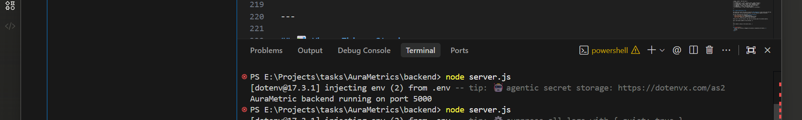
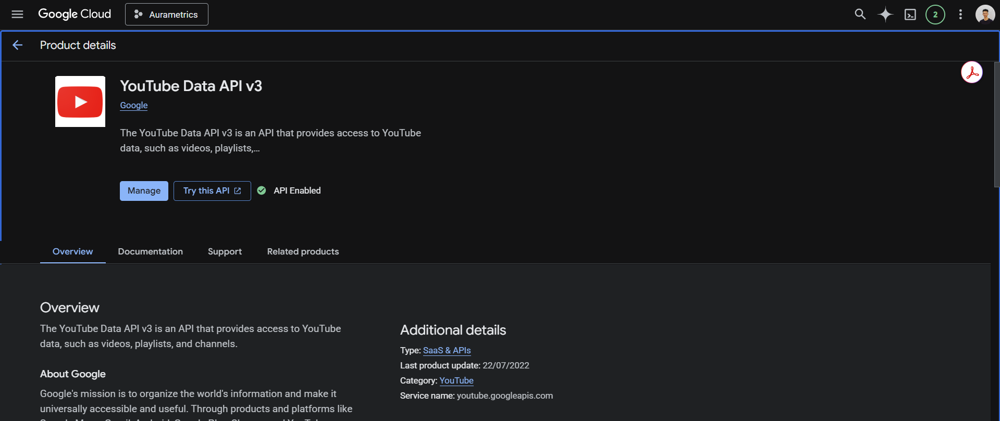
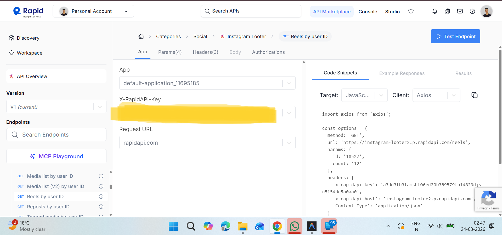
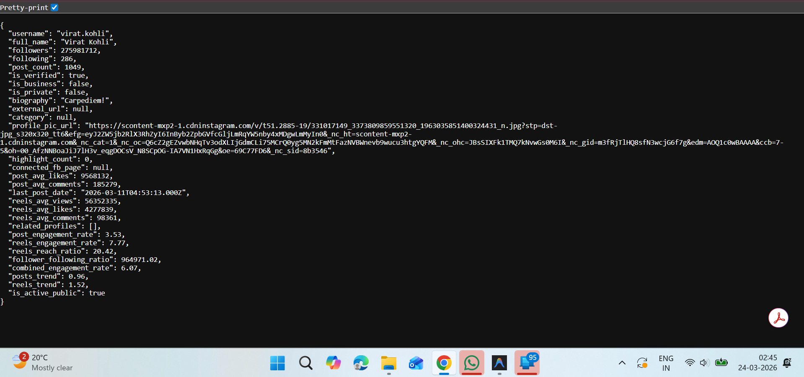

# 🌟 The AuraMetric Journey
### *A personal log of how this project went from a random thought to real working code*

> This isn't the official README. This is the real story —
> the late nights, the bugs, the "why is this not working" moments,
> and everything in between.

---

## 🌱 Where It All Started

📅 **Day 1 — Evening**

It started on a random evening when I was free and just... thinking.

I was updating my resume for internship applications and something hit me —
my projects felt **outdated**. Not bad, just not exciting enough to make a recruiter stop scrolling.

So I opened a conversation with AI and just started talking.
No plan. No structure. Just an idea floating in my head:

> *"What if I could calculate the real reach of any influencer — not just their follower count, but actually how far their content travels?"*

💡 That one sentence turned into a 2 hour conversation.

We talked about:
- What makes a reach score meaningful vs just vanity metrics
- How fake followers expose themselves through poor engagement
- A **Confidence Meter** — how much should we trust the score we calculated?
- The **Followers-to-Views Mismatch** — the gap between subscribers and actual views as a fake detection signal
- Why **Grok API** with its x_search tool was the perfect AI layer for this
- Why the name **AuraMetric** just *felt* right

> 💬 *"Aura — the invisible influence someone carries. Metric — data, precision, truth. Together — something that actually means something."*

By the time the conversation ended, I had a full project vision, a phased development plan, and genuinely felt excited about building something for the first time in a while.

Then I had dinner. 🍽️

---


---

## 🏗️ Phase 1.1 — The Foundation
📅 **Day 1 — Late Night (a little sleepy ngl)**

After dinner I sat down to start. I was tired but that post-dinner motivation hit different.

**What I built:**
- Initialized the Node.js backend from scratch
- Set up Express server
- Created the folder structure (`routes/`, `services/`)
- Added `.gitignore` so my API keys never accidentally go public 🔐
- First ever route — `/api/health` — just to confirm the server was alive

**The moment it worked:**
```
AuraMetric backend running on port 5000
```
That one line in the terminal felt unreasonably satisfying. 😄

**First commit pushed:**
```
backend: express server initialized
```

Then I got sleepy. Closed the laptop. Called it a night. 😴

---



--- 

## 📺 Phase 1.2 — YouTube Talks to Me
📅 **Day 2 — College, Lunch Break**

I had lunch early that day so I had a solid 45 minutes free.
Sat in college, opened my laptop, and decided to get YouTube working.

**What I built:**
- Connected YouTube Data API v3
- Search by name → resolve to channel ID automatically
- Fetch subscribers, total views, video count
- Calculate avg views from last 10 videos
- Derived metrics: `engagement_rate`, `view_to_sub_ratio`, `upload_frequency`, `views_trend`

**The interesting engineering decision here 🤔**

Early on I realized — users will type *"MrBeast"* but YouTube needs a **channel ID**.
I had two options:
1. Ask the user for their channel ID (bad UX)
2. Use YouTube's search API to resolve name → ID automatically

Went with option 2. Cleaner. More product-like.

**Views Trend Formula — my own:**
```
views_trend = avg(last 5 videos) ÷ avg(previous 5 videos)
Above 1.0 = growing | Below 1.0 = declining
```

**Test result for MrBeast:**
```json
{
  "subscribers": 472000000,
  "avg_views": 221241614,
  "engagement_rate": 3.9,
  "view_to_sub_ratio": 46.8
}
```

Came home after college. Was exhausted. 😮‍💨

Slept. No guilt. 💤

---



---

## 📸 Phase 1.3 — Instagram Fights Back
📅 **Day 2 — Late Night (had a lot of time, put it all in)**

This one was a journey within a journey. 😅

Instagram doesn't have an official public API — so I had to go through **RapidAPI** to scrape public data. Sounds simple. Was not.

---

### ⚔️ The Battles

**Battle 1 — The 403 Error**

First API I tried gave me a clean 403 Forbidden.
Turned out the host in my headers didn't match the API I actually subscribed to.
Classic copy-paste mistake.

**Battle 2 — 20 Requests Per Month**

Got the connection working, then noticed:
```
x-ratelimit-requests-limit: 20
```
20 requests. Per month. For a project that uses 3-4 requests per search.
That's basically nothing.

**Solution:** Added a **mock data toggle** in `.env`:
```
USE_MOCK_INSTAGRAM=true   → fake data (development)
USE_MOCK_INSTAGRAM=false  → real API (production)
```
Smart move. Saved quota for when it actually matters.

**Battle 3 — The 404 Hunt**

Switched to a better API (`instagram-looter2`).
Started hitting 404s because endpoint names were wrong:
- `/uid` → actual endpoint was `/id`
- `/media` → actual endpoint was `/user-feeds`
- `/related` → actual endpoint was `/related-profiles`

Lesson learned: **always verify endpoint URLs from the actual code snippet, not assumptions.**

**Battle 4 — Users Not Found**

Search was returning hashtags mixed in with users.
Fixed with one param: `select: 'users'`

Also added a **verified user filter** — if search returns 50 results, pick the verified one first instead of taking position 0 blindly.

**Battle 5 — Reels Returning Zeros**

Posts worked. Reels were all zeros.
Debugged the raw response and found the issue:

```javascript
// What we assumed:
items[0].play_count

// What the API actually returns:
items[0].media.play_count  ← extra nesting layer
```

One line fix. 30 minutes of debugging. Classic. 😂

---

### ✅ Final Result

```json
{
  "followers": 275981712,
  "post_avg_likes": 9568132,
  "reels_avg_views": 56352335,
  "reels_trend": 1.52,
  "combined_engagement_rate": 6.07,
  "follower_following_ratio": 964971
}
```

Real data. Virat Kohli. Live from Instagram. 🏏

Pushed the commit. Closed the laptop. Went to sleep satisfied. 🌙

---







---

## 📊 Where Things Stand

| Stage | Status | What Was Built |
|---|---|---|
| 1.1 Backend Setup | ✅ Done | Express server, folder structure |
| 1.2 YouTube API | ✅ Done | Channel stats, engagement, trends |
| 1.3 Instagram API | ✅ Done | Posts, reels, derived metrics |
| 1.4 TMDB API | 🔜 Next | Actor profiles, box office data |
| 1.5 Aggregator | 🔜 Soon | Unified data layer |
| 1.6 Profile Route | 🔜 Soon | Single endpoint for everything |

---

## 💭 Honest Reflections So Far

The hardest part wasn't the code. It was the **API debugging** — every third party API has its own quirks, its own wrong documentation, its own surprise response structures.

The most satisfying part? Designing **my own formulas**:
- `view_to_sub_ratio` for mismatch detection
- `combined_engagement_rate` weighted by platform reach
- `reels_trend` comparing recent vs older performance

These aren't from any tutorial. They came from thinking about the problem properly.

That's what makes AuraMetric feel different. 💪

---

*More chapters coming as the project grows...*

---

<div align="center">
  <i>Built with curiosity, debugged with patience, documented with honesty.</i>
  <br><br>
  — Knishk
</div>